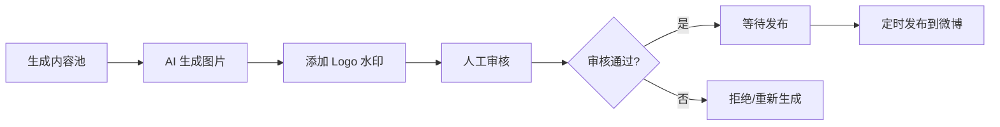

# 微博每日一句 - 开发指南

## 📋 目录

- [快速开始](#快速开始)
- [项目架构](#项目架构)
- [核心功能](#核心功能)
- [API 接口](#api-接口)
- [开发流程](#开发流程)
- [部署说明](#部署说明)

---

## 🚀 快速开始

### 1. 环境准备

确保已安装：
- Python 3.8+
- Redis（用于 Celery 任务队列）
- MySQL 8.0+（可选，数据库功能暂时搁置）

### 2. 安装依赖

```bash
cd backend

# Windows
setup_dev.bat

# Linux/Mac
python -m venv venv
source venv/bin/activate
pip install -r requirements.txt
```

### 3. 配置环境变量

编辑 `backend/.env` 文件，配置必要的 API 密钥：

```env
# AI 图片生成（至少配置一个）
OPENAI_API_KEY=sk-...
# 或
STABILITY_API_KEY=sk-...

# 微博 API（用于发布）
WEIBO_APP_KEY=...
WEIBO_APP_SECRET=...
WEIBO_ACCESS_TOKEN=...
```

### 4. 测试服务

```bash
cd backend
python test_services.py
```

### 5. 启动开发服务器

```bash
# Windows
start_dev.bat

# Linux/Mac
uvicorn app.main:app --reload --host 0.0.0.0 --port 8000
```

访问：
- API 服务：http://localhost:8000
- API 文档：http://localhost:8000/docs
- ReDoc 文档：http://localhost:8000/redoc

### 6. 启动 Celery（可选）

```bash
# 终端 1: 启动 Redis
redis-server

# 终端 2: 启动 Celery Worker
# Windows
start_celery.bat

# Linux/Mac
celery -A app.core.celery_app worker --loglevel=info

# 终端 3: 启动 Celery Beat（定时任务）
# Windows
start_celery_beat.bat

# Linux/Mac
celery -A app.core.celery_app beat --loglevel=info
```

---

## 🏗️ 项目架构

```
backend/
├── app/
│   ├── api/                  # API 路由
│   │   ├── content.py       # 内容管理
│   │   ├── review.py        # 审核管理
│   │   └── publish.py       # 发布管理
│   ├── core/                 # 核心配置
│   │   ├── config.py        # 配置管理
│   │   ├── database.py      # 数据库连接
│   │   └── celery_app.py    # Celery 配置
│   ├── models/               # 数据模型
│   │   └── content.py       # Content 和 PublishLog
│   ├── services/             # 业务逻辑层
│   │   ├── sentence_service.py   # 文案选择
│   │   ├── image_service.py      # AI 图片生成
│   │   ├── logo_service.py       # Logo 水印
│   │   └── weibo_service.py      # 微博 API
│   ├── tasks/                # Celery 异步任务
│   │   ├── content_tasks.py # 内容生成任务
│   │   └── publish_tasks.py # 发布任务
│   ├── utils/                # 工具函数
│   └── main.py              # FastAPI 入口
├── alembic/                  # 数据库迁移
├── logs/                     # 日志文件
├── test_services.py         # 服务测试脚本
├── requirements.txt         # Python 依赖
└── .env                     # 环境变量配置
```

---

## 🎯 核心功能

### 1. 文案选择模块 (`sentence_service.py`)

**功能：**
- 从 `sentence.md` 加载 150 条文案
- 随机选择未使用的文案
- 30 天去重机制
- 内容池状态监控

**关键方法：**
```python
sentence_service = SentenceService(db)

# 加载所有文案
sentences = sentence_service.load_sentences()

# 选择 30 条文案
selected = sentence_service.select_random_sentences(count=30, dedup_days=30)

# 生成内容池
contents = sentence_service.generate_content_pool(count=30)

# 获取内容池状态
status = sentence_service.get_content_pool_status()
```

### 2. AI 图片生成 (`image_service.py`)

**功能：**
- 支持 DALL-E 3 和 Stability AI
- 根据文案自动生成配图
- 尺寸：1080x1080

**关键方法：**
```python
image_service = ImageService()

# 生成图片
image_path = await image_service.generate_image(text, content_id)
```

### 3. Logo 水印 (`logo_service.py`)

**功能：**
- 智能检测背景亮度
- 自动选择原色/反白 Logo
- 可配置位置和大小

**关键方法：**
```python
logo_service = LogoService()

# 添加水印
final_path, logo_version = logo_service.add_watermark(
    image_path, 
    output_path, 
    position="bottom_right"
)
```

### 4. 微博 API (`weibo_service.py`)

**功能：**
- OAuth 2.0 认证
- 图片上传和发布
- 发布状态查询

**关键方法：**
```python
weibo_service = WeiboService()

# 发布微博（带图片）
result = weibo_service.publish_status(text, image_path)

# 获取授权 URL
auth_url = weibo_service.get_authorize_url()

# 获取 access_token
token_info = weibo_service.get_access_token(code)
```

---

## 📡 API 接口

### 内容管理 (`/api/content`)

| 方法 | 路径 | 说明 |
|------|------|------|
| POST | `/generate` | 生成内容池（选择文案） |
| POST | `/{content_id}/generate-image` | 生成 AI 图片 |
| POST | `/{content_id}/add-watermark` | 添加 Logo 水印 |
| POST | `/{content_id}/process` | 完整处理（图片+水印） |
| GET | `/` | 获取内容列表 |
| GET | `/{content_id}` | 获取内容详情 |
| DELETE | `/{content_id}` | 删除内容 |
| GET | `/pool/status` | 获取内容池状态 |

### 审核管理 (`/api/review`)

| 方法 | 路径 | 说明 |
|------|------|------|
| POST | `/{content_id}/review` | 审核内容 |
| POST | `/{content_id}/reset` | 重置审核状态 |
| GET | `/pending/count` | 待审核数量 |
| GET | `/approved/count` | 已通过数量 |

### 发布管理 (`/api/publish`)

| 方法 | 路径 | 说明 |
|------|------|------|
| POST | `/` | 发布内容到微博 |
| GET | `/next` | 获取下一个可发布内容 |
| POST | `/schedule` | 手动触发定时发布 |
| GET | `/logs` | 获取发布日志 |
| GET | `/stats` | 获取发布统计 |

---

## 🔄 开发流程

### 典型工作流程



### 1. 生成内容池

**API 调用：**
```bash
POST http://localhost:8000/api/content/generate
{
  "count": 30
}
```

**命令行：**
```python
from app.services.sentence_service import SentenceService
sentence_service = SentenceService(db)
contents = sentence_service.generate_content_pool(30)
```

### 2. 处理内容（图片+水印）

**API 调用：**
```bash
POST http://localhost:8000/api/content/{content_id}/process
```

### 3. 审核内容

**API 调用：**
```bash
POST http://localhost:8000/api/review/{content_id}/review
{
  "approved": true,
  "reviewer_id": 1
}
```

### 4. 发布到微博

**手动发布：**
```bash
POST http://localhost:8000/api/publish/
{
  "content_id": 1
}
```

**定时发布：** 每天早上 8:00 自动触发（需启动 Celery Beat）

---

## 📦 部署说明

### Zeabur 部署（推荐）

项目已配置 Zeabur 部署支持。

**文件：**
- `zbpack.json` - Zeabur 构建配置
- `zeabur.yaml` - 服务配置

**环境变量（在 Zeabur 面板配置）：**
```env
ENV=production
DATABASE_URL=${MYSQL_URL}
REDIS_URL=${REDIS_URL}
WEIBO_APP_KEY=...
WEIBO_APP_SECRET=...
WEIBO_ACCESS_TOKEN=...
OPENAI_API_KEY=...
SENTENCE_FILE_PATH=/app/sentence.md
LOGO_DIR_PATH=/app/logo
OUTPUT_DIR_PATH=/app/data/images
```

### Docker 部署

```bash
# 构建镜像
docker build -t weibo-daily-sentence .

# 运行容器
docker run -d \
  -p 8000:8000 \
  -e DATABASE_URL=... \
  -e REDIS_URL=... \
  -e OPENAI_API_KEY=... \
  weibo-daily-sentence
```

---

## 🛠️ 故障排查

### 1. 文案加载失败

**错误：** `Sentence file not found`

**解决：** 检查 `.env` 中的 `SENTENCE_FILE_PATH` 是否正确

### 2. Logo 未加载

**错误：** `Color logo not found`

**解决：** 确保 `logo/` 目录下存在以下文件：
- `PUDOW朴道健康水专家-原色.png`
- `PUDOW朴道健康水专家-反白.png`

### 3. 图片生成失败

**错误：** `No AI image generation API configured`

**解决：** 在 `.env` 中配置 `OPENAI_API_KEY` 或 `STABILITY_API_KEY`

### 4. Celery 任务不执行

**检查：**
1. Redis 是否运行：`redis-cli ping`
2. Celery Worker 是否启动
3. Celery Beat 是否启动（定时任务）

---

## 📝 待办事项

查看 [TODO.md](../TODO.md) 了解项目进度和待办任务。

---

## 🤝 贡献

如有问题或建议，请创建 Issue 或提交 Pull Request。

---

## 📄 许可证

Private Project
